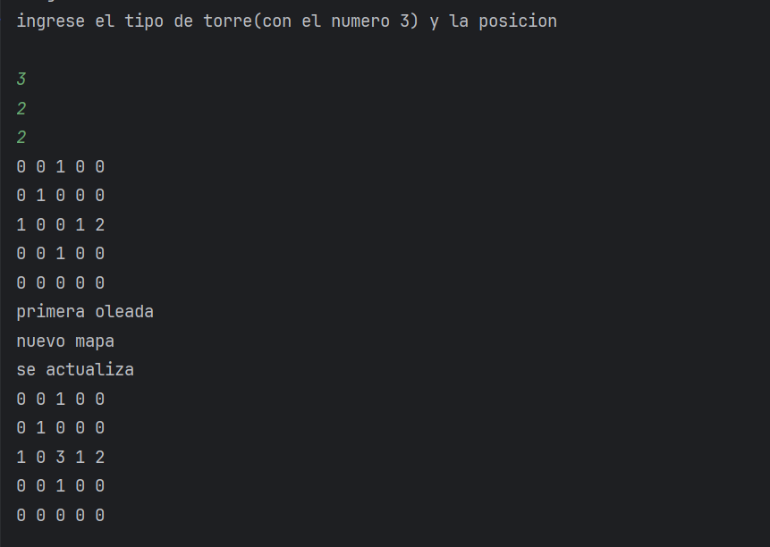

# PC4RUIZ ARICA

# Tower Defense

El juego es un juego de defensa de torres donde el jugador debe defender su base de oleadas de enemigos colocando torres en lugares estratégicos del mapa

**Matriz del mapa:**

- Una celda vacía (' ' o 0) representa un espacio disponible para colocar una torre.
- Una celda de camino ('C' o 1) representa el camino por el que los enemigos se desplazan.
- La base ('B' o 2) representa el objetivo que los enemigos deben alcanzar.
- En este caso use {0 ,1,2} como **elementos del mapa para los enemigos**
- {3} es la instancia de una **torre**

Los enemigos seguirán el camino definido por las '1' hasta llegar a la base '2'.

### Map

```java
package org.example;

public class Map {
//creacion del mapa (diseño predefinido)
    int[][] map = {
            {0, 0, 1, 0, 0},
            {0, 1, 0, 0, 0},
            {1, 0, 0, 1, 2},
            {0, 0, 1, 0, 0},
            {0, 0, 0, 0, 0}};
    public int[][] getMap() {
        return map;
    }

    public void setMap(int[][] map) {
        this.map = map;
    }

    public void printMap() {
        for (int i = 0; i < map.length; i++) {
            for (int j = 0; j < map[i].length; j++) {
                System.out.print(map[i][j] + " ");
            }
            System.out.println();
        }
    }

}

```

## Piezas del juego

### **Enemigos**

Los enemigos son las entidades que el jugador debe detener. Tienen varias características que determinan su comportamiento y dificultad.

```java
package org.example;

public class Enemy {
    private int speed; // número de celdas por turno
    private int health;//vida
    private int reward;//premio

    public Enemy(int speed, int health, int reward) {
        this.speed = speed;
        this.health = health;
        this.reward = reward;
    }
    // Constructores, getters y setters

    public int getSpeed() {
        return speed;
    }
}

```

## Tipos de enemigos

### BasicEnemy (enemigo basico)

```java
package org.example;

public class BasicEnemy extends Enemy {
    public BasicEnemy() {
        super(1, 100, 10); // velocidad, vida, recompensa
    }
}

```

### BossEnemy (jefe enemigo)

```java
package org.example;

public class BossEnemy extends Enemy {
    public BossEnemy() {
        super(3, 200, 20); // velocidad, vida, recompensa
    }

}

```

### **Torres**

Descripción: Las torres son las defensas que el jugador coloca en el mapa para detener a los
enemigos. Tienen diferentes características y habilidades.
**Tipos de torres:**
Cañón: Alto daño, corto alcance.
Láser: Daño moderado, largo alcance.
Flecha: Daño bajo, alcance moderado, alta velocidad de disparo

```java
package org.example;

public class Tower {
    private int damage;
    private int range;
    private int fireRate; // turnos entre disparos
    // Constructores, getters y setters

    public Tower(int damage, int range, int fireRate) {
        this.damage = damage;
        this.range = range;
        this.fireRate = fireRate;
    }

    public int getDamage() {
        return damage;
    }
    public int getRange() {
        return range;
    }
    public int getFireRate() {
        return fireRate;
    }
}

```

### Sistema de oleadas

Descripción: Los enemigos llegan en oleadas que aumentan en dificultad a medida que avanza el
juego. Cada oleada puede tener más enemigos o enemigos más fuertes.
Configuración de oleadas:
Número de enemigos: Cantidad de enemigos por oleada.
Tipo de enemigos: Variedad de enemigos que aparecen en la oleada.

```java
package org.example;

import java.util.ArrayList;
import java.util.List;

public class Wave {
    private List<Enemy> enemies;
    private int waveNumber;
    public Wave(int waveNumber) {
        this.waveNumber = waveNumber;
        this.enemies = generateEnemies(waveNumber);
    }
    private List<Enemy> generateEnemies(int waveNumber) {
        List<Enemy> enemies = new ArrayList<>();
        for (int i = 0; i < waveNumber * 5; i++) { // más enemigos cada oleada
            enemies.add(new BasicEnemy());
        }
        if (waveNumber % 5 == 0) { // jefe cada 5 oleadas
            enemies.add(new BossEnemy());
        }
        return enemies;
    }
    // Métodos para manejar el progreso de la oleada
    public int getWaveNumber() {
        return waveNumber;
    }
    public List<Enemy> getEnemies() {
        return enemies;
    }
}
```

### Sistema de puntuación

Descripción: El jugador gana puntos por derrotar enemigos y pierde puntos si los enemigos alcanzan
la base.
Puntos por enemigo derrotado: Cada enemigo tiene una recompensa que se suma a la puntuación
del jugador.

```java
package org.example;

public class Player {
    private int score;
    private int baseHealth;
    public Player() {
        this.score = 0;
        this.baseHealth = 100;
    }
    public void addScore(int points) {
        this.score += points;
    }
    public void deductBaseHealth(int damage) {
        this.baseHealth -= damage;
    }
    public int getScore() {
        return score;
    }
    public int getBaseHealth() {
        return baseHealth;
    }
    // Métodos adicionales según las necesidades del juego
}

```

## Logica del Juego

### Game

En la clase `Game` ira la logica del juego , donde se añadirán los métodos para insertar la torres en cierta posición , inicializar las oleada y actualizar el estado del juego.

```java
package org.example;

import java.util.ArrayList;
import java.util.List;

public class Game {
    private Map map;
    private Player player;
    private List<Wave> waves;
    private int score;
    private final int baseHealth;

    public Game() { //definir constructores
        this.map = new Map();
        this.player = new Player();
        this.waves = new ArrayList<>();
        this.score = 0;
        this.baseHealth = 100;
        initializeGame();
    }

    private void initializeGame() { //inicializar el juego
        Map map = new Map();
        Player player = new Player();
        List<Wave> waves = new ArrayList<>();
        waves.add(new Wave(1));
        this.map = map;
        this.player = player;
        this.waves = waves;
    }

    public void placeTower(Tower tower, int x, int y) {//colocar la torre en la posicion(x,y)
        if (isValidTowerPlacement(x, y)) {
            map.placeTower(tower, x, y);

        } else {
            System.out.println("no se puede colocar la torre en esa posicion");
        }
    }

    private boolean isValidTowerPlacement(int x, int y) { //validar la colocacion de la torre
        if (x >= 0 && x < map.getMap().length && y >= 0 && y < map.getMap()[0].length && map.getMap()[x][y] == 0) {
            return true;
        }
        return false;
    }
    public void startWave() {
        Wave wave = new Wave(1);
        this.waves.add(wave);

    }

    public void updateGameState() {
//actualizar el estado del juego
        if (!waves.isEmpty()) {
            Wave wave = waves.get(0);
            if (wave.getEnemies().isEmpty()) {
                finishWave();
            }
        }
    }

    public void finishWave() { //finalizar la oleada
        if (!waves.isEmpty()) {
            waves.remove(0);
        }
    }

    public boolean isGameOver() {//validar si el juego ha terminado
        return baseHealth <= 0;
    }

}

```

Una vez hecha la logica del juego procedemos a iniciar el juego en la `Main` : 

```java
package org.example;

import java.util.Scanner;

public class Main {
    static Map map = new Map();
    int playerHealth = new Player().getBaseHealth();
    static Tower tower = new Tower(10, 100, 10);
    static Game game = new Game();

    public static void main(String[] args) {
        System.out.println("Juego de torres iniciado");
        System.out.println("ingrese el tipo de torre(con el numero 3) y la posicion");
        Scanner sc = new Scanner(System.in);
        Scanner text = new Scanner(System.in);
        int tipo_torre = sc.nextInt();
        int x = sc.nextInt();
        int y = sc.nextInt();
        String comando = sc.nextLine();
        tower = new Tower(tipo_torre, x, y);
        map.printMap();

            System.out.println("primera oleada");
            System.out.println("nuevo mapa");
            game.startWave(); //iniciar la oleada
            game.placeTower(tower, x, y);
            map.printMap();
        

    }
}

```

Salida : 



## Refactorizacion  :

Para ello aplicaremos los principios SOLID .Por ejemplo vemos que en la clase `Game` el constructor se instancia 2 veces en el la clase game y en el metodo initializeGame() ,asi como la clase `Map`  maneja muchas responsabilidad lo cual va en contra del prinicipio de SRP 

`Map.java`

```java
package org.example;

import java.util.List;

public class Map {
    private int[][] map;
    public Map() {
        this.map = new int[][]{
                {0, 0, 1, 0, 0},
                {0, 1, 0, 0, 0},
                {1, 0, 0, 1, 2},
                {0, 0, 1, 0, 0},
                {0, 0, 0, 0, 0}};
    }
    public boolean isValidPosition(int x, int y) {
        return map[x][y] == 0; //validar la posicion
    }
    public void placeTower( int x, int y) {
        map[x][y] = 3;
    }

    public void printMap(List<Tower> towers) { //imprimir el mapa
        for (int i = 0; i < map.length; i++) {
            for (int j = 0; j < map[i].length; j++) {
               boolean isTower = false; //verificar si hay torre
                for (Tower tower : towers) {
                    if (tower.getX() == i && tower.getY() == j) {
                        System.out.print("[T]");
                        isTower = true;
                        break;
                    }
                }
                if (!isTower) {
                    if(map[i][j] == 0) {
                        System.out.print("[ ]");
                    } else if (map[i][j] == 1) {
                        System.out.print("[C]");
                    } else if (map[i][j] == 2) {
                        System.out.print("[B]");
                    }
                }

            }
            System.out.println();
        }
    }
    public void attackEnemies(List<Tower> towers,List<Enemy> enemies) {
        for (Tower tower : towers) {
            tower.attackEnemies(enemies);
        }
    }
    public int[][] getMap() {
        return map;
    }
}
```

`Game.java`

```java
package org.example;

import java.util.ArrayList;
import java.util.List;
import java.util.Scanner;

public class Game {
    private Map map;
    private Player player;
    private List<Wave> waves;
    private int currentWaveInvex; //indica la oleada actual
    private boolean gameRunning; //indica si el juego esta corriendo o no

    public Game() { //definir constructores
        this.map = new Map();
        this.player = new Player();
        this.waves = new ArrayList<>();
        this.currentWaveInvex = 0;
        this.gameRunning = true;
        initializeGame();
    }

    private void initializeGame() { //inicializar el juego
        this.waves.add(new Wave(1)); //inicializar la primera oleada
    }

    public void start(){
        Scanner sc = new Scanner(System.in);
        while(gameRunning){
            System.out.println("estado del juego ");
            map.printMap();
            System.out.println("puntuacion "+ player.getScore());
            System.out.println("vida de la base "+ player.getBaseHealth());
            System.out.println("ingrese comando: PLACE_TOWER (tipo_torre,x,y) | START_WAVE | EXIT");
            String comando = sc.nextLine();
            proccesCommand(comando); //procesar el comando
            if(player.getBaseHealth()<=0){
                gameRunning = false;
                System.out.println("la base ha sido destruida, perdio");
            }
        }
        sc.close();
    }

    private void proccesCommand(String comando) {
        String[] parts  = comando.split(" ");//separar el comando por espacios
        switch (parts[0]) {
            case "PLACE_TOWER":
                int tipo_torre = Integer.parseInt(parts[1]);
                int x = Integer.parseInt(parts[2]);
                int y = Integer.parseInt(parts[3]);
                placeTower(new Tower(tipo_torre, x, y), x, y);
                break;
            case "START_WAVE":
                startWave();
                break;
            case "EXIT":
                gameRunning = false;
                break;
            default:
                System.out.println("comando no valido");
                break;
        }
    }
    public void startWave() { //iniciar la oleada
        if(currentWaveInvex < waves.size()){
            Wave currentWave = waves.get(currentWaveInvex);
            currentWaveInvex++;
            if(currentWaveIndex%5==0){
                waves.add(new Wave(currentWaveIndex+1));
            }
        }
    }

    public void placeTower(Tower tower, int x, int y) {//colocar la torre en la posicion(x,y)
        Tower tower = TowerFactory.createTower(type);
        if (tower !=null) {
            if(map.isValidPosition(x,y)) {
                map.placeTower(tower, x, y);
            } else {
                System.out.println("no se puede colocar la torre en esa posicion");
            }

        } else {
            System.out.println("tipo de torre invalida");
        }
    }

}

```

Usando el DIP , prinicipio  de inversion de dependencias , implementaremos las interfaces TowerFactory y Enenmy Factory en lugar de ultilizar clases directas en la logia del juego.

```java
package org.example;

public interface EnemyFactory {

    public Enemy createEnemy();
}

```

un ejemplo de como lo implementamos en SpeedyEnemyFactory se muestra a continuación : 

```java
package org.example;

import org.example.TypeEnemy.SpeedyEnemy;

public class SpeedyEnemyFactory implements EnemyFactory {
    @Override
    public Enemy createEnemy() {
        return new SpeedyEnemy();
    }
}
```

## Mocks

Usamos @Mock  para crear la `Enemy,Tower,EnemyFactory y TowerFactory`simulacions de instancias de la clase 

```java
public class TowerDefenseGameTest {
    @Mock
    Enemy enemyMock;

    @Mock
    Tower towerMock;

    @Mock
    EnemyFactory basicEnemyFactoryMock;

    @Mock
    TowerFactory cannonTowerFactoryMock;

    public TowerDefenseGameTest() {
        // Inicializa los mocks creados con la anotación @Mock
        MockitoAnnotations.initMocks(this);
    }

    @Test
    public void testEnemyTowerInteraction() {
        // Configura el mock enemyMock para que devuelva la posición (1, 1)
        when(enemyMock.getX()).thenReturn(1);
        when(enemyMock.getY()).thenReturn(1);

        // Crea una instancia real de CannonTower y establece su posición en (0, 0)
        Tower tower = new CannonTower();  // Daño 50, Rango 5, Tasa de disparo 2
        tower.setPosition(0, 0);

        // Simula la interacción atacando al enemyMock
        tower.attack(Arrays.asList(enemyMock));

        // Verifica que el método takeDamage(50) fue invocado en el enemyMock
        verify(enemyMock).takeDamage(50);
    }
 }
```

## Stubs

Crearemos stubs para un enemigo específico y una torre específica.creaemos el test`testStubMethods`:

```java
 @Test
    public void testStubMethods() {
        // Crea stubs (implementaciones simuladas) para los enemigos y torres específicas
        Enemy specificEnemy = new BasicEnemy();
        Tower specificTower = new CannonTower();

        // Configura los mocks para que devuelvan los stubs creados
        when(basicEnemyFactoryMock.createEnemy()).thenReturn(specificEnemy);
        when(cannonTowerFactoryMock.createTower()).thenReturn(specificTower);

        // Verifica que los stubs devueltos son correctos
        assertEquals(100, basicEnemyFactoryMock.createEnemy().getHealth());
        assertEquals(50, cannonTowerFactoryMock.createTower().getDamage());
    }
```

## Fakes

Creamos una base de datos falsa para almacenar las puntuaciones de cada jugador

```java
@Test
    public void testFakeDatabase() {
        // Crea una base de datos falsa para simular las puntuaciones
        FakeScoreDatabase fakeDB = new FakeScoreDatabase();
        fakeDB.addScore("Jugador1", 1000);

        // Verifica que las puntuaciones se almacenan y recuperan correctamente
        assertEquals(1000, fakeDB.getScore("Jugador1"));
        assertEquals(0, fakeDB.getScore("Jugador2"));
    }

    // Clase interna para simular una base de datos de puntuaciones
    public class FakeScoreDatabase {
        private Map<String, Integer> scores = new HashMap<>();

        // Método para agregar una puntuación
        public void addScore(String player, int score) {
            scores.put(player, score);
        }

        // Método para obtener la puntuación de un jugador
        public int getScore(String player) {
            return scores.getOrDefault(player, 0);
        }
    }
```

Ejecutamos las pruebas, y pasan exitosamente


## Pruebas de mutación:

Implementa pruebas de mutación para verificar la calidad de las pruebas unitarias.
• ¿Qué herramienta utilizarías para realizar pruebas de mutación en este proyecto, y cómo la
configurarías?

Usare la herramienta Pitest .Para ello iremos a la pagina https://gradle-pitest-plugin.solidsoft.info/

y en nuestro buil.gradle insertamos lo siguiente : 

```java
plugins {
    id 'java' //or 'java-library' - depending on your needs
    id 'info.solidsoft.pitest' version '1.15.0'
}
    pitest 'org.pitest:pitest-junit5-plugin:1.1.0' //dependences
pitest {
    targetClasses = ['org.example.*'] // Paquete de clases a mutar
    mutators = ['DEFAULTS'] // Conjunto de mutadores [OLD_DEFAULTS, DEFAULTS, STRONGER, ALL]
    outputFormats = ['HTML'] // Formato de salida del informe
    timestampedReports = false // Deshabilitar informes con marca de tiempo para facilitar la navegación
    verbose = true
}
```

Abrimos nuestro terminal y ejecutamos el siguiente comando 
`gradle pitest`

• Configura la herramienta de pruebas de mutación para el proyecto y ejecuta un análisis de mutación en la clase TowerDefenseGame.

Ejecutamos Pitest:


Con respecto a la clase [`Tower.java`](http://Tower.java) indica que tiene una buena conbertura de linea(70%),pero la cobertura de mutacion podria mejorarse (30%)

Creare nuevas pruebas para esta clase , con casos que no estan siendo cubiertos . 

Test **testTowerCooldown:** 

La prueba verifica que la torre no ataca durante su período de enfriamiento , este se refiere al tiempo en el que la torre espera su turno

```java
@Test
public void testTowerCooldown() {
    // Crear una instancia real de CannonTower y establecer su posición
    Tower tower = new CannonTower();  // Daño 50, Rango 5, Tasa de disparo 2
    tower.setPosition(0, 0);

    // Configurar el comportamiento del enemyMock para estar dentro del rango
    when(enemyMock.getX()).thenReturn(1);
    when(enemyMock.getY()).thenReturn(1);

    // Simular un ataque para iniciar el cooldown
    tower.attack(Arrays.asList(enemyMock));
    // Simular otro ataque mientras la torre está en cooldown
    tower.attack(Arrays.asList(enemyMock));
    
    // Verificar que el método takeDamage fue invocado solo una vez
    verify(enemyMock, times(1)).takeDamage(50);
}
```

**testEnemyOutOfRange :** 

verifica que la torre no ataque a su enemigo que esta fuera de su rango de ataque

```java

@Test
public void testEnemyOutOfRange() {
    // Configurar el comportamiento del enemyMock para estar fuera de rango
    when(enemyMock.getX()).thenReturn(6); // Fuera del rango de la torre
    when(enemyMock.getY()).thenReturn(6); // Fuera del rango de la torre

    // Crear una instancia real de CannonTower y establecer su posición
    Tower tower = new CannonTower();  // Daño 50, Rango 5, Tasa de disparo 2
    tower.setPosition(0, 0);

    // Simular la interacción
    tower.attack(Arrays.asList(enemyMock));

    // Verificar que el método takeDamage no fue invocado
    verify(enemyMock, never()).takeDamage(anyInt());
}
```

Ahora ejecutamos nuevamente Pitest : 


vemos que ha habido una mejor en el codigo de linea y de mutacion y esto se debe a los dos test añadidos , ya que cubren casos adicionales. 

## Preguntas de diseño e implementación

### **Diseño de la clase Map:**

¿Cómo implementarías la clase Map para representar el mapa del juego, asegurando que se puedan agregar y verificar posiciones de torres y caminos?

Para ello se crea dos metoods un metodo donde se pueda insertar las torres ,talque su posicion sea valida este metodo es : 
`placeTower`  y para validar el metodo 
`isValidTowerPlacement`
• Implementa un método en la clase Map llamado isValidPosition(int x, int y) que verifique si una posición es válida para colocar una torre.

```java
 private boolean isValidTowerPlacement(int x, int y) { //validar la colocacion de la torre
        if (x>=0 && x < map.getMap().length && y>= 0 && y < map.getMap()[0].length && map.getMap()[x][y] == 0) {
            return true;
        }else{
            System.out.println("no se puede colocar la torre en esa posicion");
            return false;
        }

    }
```

### **Enemigos con diferentes características:**

Diseña e implementa una clase SpeedyEnemy que herede de Enemy y tenga una velocidad mayor pero menos vida.

La clase SpeedyEnemy se muestra acontinuacion : 

```java
package org.example;

public class SpeedyEnemy extends Enemy{

    public SpeedyEnemy() {
        super(3, 30, 6);
    }
}

```

• ¿Cómo gestionarías el movimiento de los enemigos en el mapa, asegurando que sigan el camino predefinido?

Creando un metodo `moveEnemy`  donde se pueda verficar el movimiento de ellos y validarlo creando la respectivas pruebas unitarias

### **Torres con diferentes habilidades:**

Implementa una clase SniperTower que tenga un daño alto y un alcance muy largo pero una velocidad de disparo baja.

```java
package org.example.TypeTower;
import org.example.Tower;

public class SniperTower extends Tower {
    public SniperTower() {
        super(200, 10, 5); // Daño alto (100), alcance muy largo (15), velocidad de disparo baja (5)
    }
}

```

• ¿Cómo implementarías el método attack(List<Enemy> enemies) en la clase Tower para
atacar a los enemigos dentro de su alcance?

Para ello implementamos una condicional en el metodo `attack(List<Enemy> enemies)` 

```java
public void attack(List<Enemy> enemies) {
        if (fireCooldown == 0) {
            for (Enemy enemy : enemies) {
                if (isInRange(enemy)) {
                    enemy.takeDamage(damage);
                    fireCooldown = fireRate;
                    break;  // Ataque simple a un enemigo a la vez
                }
            }
        } else {
            fireCooldown--;
        }
    }
```

### Sistema de oleadas:

• ¿Cómo diseñarías la generación de oleadas para que cada oleada sea progresivamente más
difícil?

En este caso crearia el metodo `generateEnemies` en el cual cada 5 oleadas aparece un jefe (BossEnemy):

```java
private List<Enemy> generateEnemies(int waveNumber) {
        List<Enemy> enemies = new ArrayList<>();
        EnemyFactory factory = new BasicEnemyFactory();
        for (int i = 0; i < waveNumber * 5; i++) {
            enemies.add(factory.createEnemy());
        }
        if (waveNumber % 5 == 0) {
            factory = new BossEnemyFactory();
            enemies.add(factory.createEnemy());
        }
        return enemies;
    }
```

• Implementa un método en la clase Wave llamado spawnEnemies() que genere los enemigos
de la oleada y los coloque en el mapa

```java
 public void spawnEnemies(Map map, Player player) {
        // Inicializa la posición de los enemigos
        for (Enemy enemy : enemies) {
            enemy.move(map.getGrid());
        }
    }
```

### Sistema de puntuación y salud de la base:

• ¿Cómo actualizarías la puntuación del jugador y la salud de la base cuando un enemigo es derrotado o alcanza la base?

Para actualizar la puntuación del jugador y la salud de la base cuando un enemigo es derrotado o alcanza la base, voy a implementar el método `updateScoreAndHealth` en la clase `Player`.
• Implementa un método en la clase Player llamado updateScoreAndHealth(Enemy enemy,
boolean defeated).

```java
public void updateScoreAndHealth(Enemy enemy, boolean defeated) {
        if (defeated) {
            addScore(enemy.getReward());
        } else {
            deductBaseHealth(enemy.getSpeed());
        }
    }
```

## Pruebas estructurales

Cobertura de ramas

Primero crearemos la clase `TowerDefenseGame` : 

```java
package org.example;

public class TowerDefenseGame {
    private Map map;

    public TowerDefenseGame(Map map) {
        this.map = map;
    }

    public void placeTower(Tower tower, int x, int y) {
        if (map.isValidPosition(x, y)) {
            map.placeTower(tower, x, y);
        }
    }
}
```

Implementamos las respectivas pruebas unitarias para verfiicar la posicion de la torre  : 

```java
package org.example;
import org.example.TypeTower.CannonTower;
import org.junit.jupiter.api.Test;
import org.mockito.Mock;
import org.mockito.MockitoAnnotations;
import static org.mockito.ArgumentMatchers.any;
import static org.mockito.ArgumentMatchers.eq;
import static org.mockito.Mockito.*;
public class TowerDefenseeGameeTest {
    @Mock
    private Map mockMap;

    private TowerDefenseGame game;

    public void TowerDefenseGameTest() {
        MockitoAnnotations.initMocks(this);
        game = new TowerDefenseGame(mockMap);
    }

    @Test
    public void testPlaceTower_ValidPosition() {
        // Configurar mock para posición válida
        when(mockMap.isValidPosition(3, 4)).thenReturn(true);
        game.placeTower(new CannonTower(), 3, 4);
        // Verificar que la torre se haya colocado
        verify(mockMap).placeTower(any(Tower.class), eq(3), eq(4));
    }

    @Test
    public void testPlaceTower_InvalidPosition() {
        // Configurar mock para posición inválida
        when(mockMap.isValidPosition(3, 4)).thenReturn(false);
        game.placeTower(new CannonTower(), 3, 4);
        // Verificar que la torre no se haya colocado
        verify(mockMap, never()).placeTower(any(Tower.class), eq(3), eq(4));
    }
}

```


**Cobertura de Condiciones**

Escribe pruebas unitarias para verificar todas las condiciones en el método attack de la clase Tower.

```java
package org.example;

import org.example.Enemy;
import org.example.TypeEnemy.BasicEnemy;
import org.example.TypeTower.CannonTower;
import org.junit.jupiter.api.Test;
import static org.junit.jupiter.api.Assertions.*;

import java.util.Arrays;
import java.util.List;

public class TowerAttackTest {
    @Test
    public void testAttack_EnemyInRange() {
        List<Enemy> enemies = Arrays.asList(new BasicEnemy());
        enemies.get(0).setPosition(2, 2);
        Tower tower = new CannonTower();
        tower.setPosition(2, 1);
        tower.attack(enemies);
        // Verificar que el enemigo ha recibido daño
        assertEquals(50, enemies.get(0).getHealth());
    }

    @Test
    public void testAttack_EnemyOutOfRange() {
        List<Enemy> enemies = Arrays.asList(new BasicEnemy());
        enemies.get(0).setPosition(5, 5);
        Tower tower = new CannonTower();
        tower.setPosition(2, 1);
        tower.attack(enemies);
        // Verificar que el enemigo no ha recibido daño
        assertEquals(100, enemies.get(0).getHealth());
    }
}

```

**Cobertura de rutas:**

pruebas para cubrir todos los caminos posibles en el método `startWave`.

```java
package org.example;

import java.util.List;

public class TowerDefenseGame {
    private Map map;
    private List<Enemy> enemies;
    private Wave currentWave;
    private Player player;

    public TowerDefenseGame(Map map, Player player) {
        this.map = map;
        this.player = player;
    }

    public void setWave(Wave wave) {
        this.currentWave = wave;
    }

    public void startWave() {
        enemies = currentWave.spawnEnemies(map, player);
        // Iniciar la oleada
        // Otros comportamientos relacionados con el inicio de la oleada
    }

    public void placeTower(Tower tower, int x, int y) {
        if (map.isValidPosition(x, y)) {
            map.placeTower(tower, x, y);
        }
    }

    public List<Enemy> getEnemies() {
        return enemies;
    }
}

```

Prueba `TowerWaveGameTest`

```java
package org.example;

import org.example.TypeEnemy.BasicEnemy;
import org.junit.jupiter.api.BeforeEach;
import org.junit.jupiter.api.Test;
import org.mockito.Mock;
import org.mockito.MockitoAnnotations;

import java.util.Arrays;
import java.util.Collections;

import static org.junit.jupiter.api.Assertions.*;
import static org.mockito.Mockito.*;

public class TowerWaveGameTest {
    @Mock
    private Map mockMap;

    @Mock
    private Wave mockWave;

    @Mock
    private Player mockPlayer;

    private TowerDefenseGame game;

    @BeforeEach
    public void setUp() {
        MockitoAnnotations.initMocks(this);
        game = new TowerDefenseGame(mockMap, mockPlayer);
    }

    @Test
    public void testStartWave_WithEnemies() {
        when(mockWave.spawnEnemies(any(Map.class), any(Player.class))).thenReturn(Arrays.asList(new BasicEnemy()));
        game.setWave(mockWave);
        game.startWave();
        // Verificar que los enemigos han sido generados y la oleada ha comenzado
        assertFalse(game.getEnemies().isEmpty());
    }

    @Test
    public void testStartWave_NoEnemies() {
        when(mockWave.spawnEnemies(any(Map.class), any(Player.class))).thenReturn(Collections.emptyList());
        game.setWave(mockWave);
        game.startWave();
        // Verificar que no se han generado enemigos
        assertTrue(game.getEnemies().isEmpty());
    }
}

```

## Preguntas de pruebas con Mockito

Mocking de dependencias:
• ¿Cómo usarías Mockito para crear un mock del Map y probar la colocación de torres en laclase TowerDefenseGame?

Usamos Mockito para simular el comportamiento del mapa. Luego, configuramos el mock para que devuelva valores específicos cuando se le llame con ciertos parámetros, y verificamos que los métodos del mock sean llamados correctamente.

• Implementa un test con Mockito para verificar que el método placeTower solo permite colocar torres en posiciones válidas del mapa. 

```java
package org.example;
import org.example.TypeTower.CannonTower;
import org.junit.jupiter.api.BeforeEach;
import org.junit.jupiter.api.Test;
import org.mockito.Mock;
import org.mockito.MockitoAnnotations;
import static org.mockito.ArgumentMatchers.any;
import static org.mockito.ArgumentMatchers.eq;
import static org.mockito.Mockito.*;

public class TowerDefenseeGameeTest {
    @Mock
    private Map mockMap;

    @Mock
    private Player mockPlayer;

    private TowerDefenseGame game;

    @BeforeEach
    public void setUp() {
        MockitoAnnotations.initMocks(this);
        game = new TowerDefenseGame(mockMap, mockPlayer);
    }

    @Test
    public void testPlaceTower_ValidPosition() {
        // Configurar mock para posición válida
        when(mockMap.isValidPosition(3, 4)).thenReturn(true);
        game.placeTower(new CannonTower(), 3, 4);
        // Verificar que la torre se haya colocado
        verify(mockMap).placeTower(any(Tower.class), eq(3), eq(4));
    }

    @Test
    public void testPlaceTower_InvalidPosition() {
        // Configurar mock para posición inválida
        when(mockMap.isValidPosition(3, 4)).thenReturn(false);
        game.placeTower(new CannonTower(), 3, 4);
        // Verificar que la torre no se haya colocado
        verify(mockMap, never()).placeTower(any(Tower.class), eq(3), eq(4));
    }
}

```

Stubbing de métodos:
• ¿Cómo usarías stubs en Mockito para simular el comportamiento del método getEnemies en
la clase Wave durante las pruebas?

Primero configuramos el mock para que devuelva una lista específica de enemigos cuando se llama al método `getEnemies` o `spawnEnemies`
• Implementa un test que use un stub para verificar el comportamiento del método startWave
en la clase TowerDefenseGame

```java
package org.example;

import org.example.TypeEnemy.BasicEnemy;
import org.junit.jupiter.api.BeforeEach;
import org.junit.jupiter.api.Test;
import org.mockito.Mock;
import org.mockito.MockitoAnnotations;

import java.util.Arrays;
import java.util.Collections;

import static org.junit.jupiter.api.Assertions.*;
import static org.mockito.Mockito.*;

public class TowerWaveGameTest {
    @Mock
    private Map mockMap;

    @Mock
    private Wave mockWave;

    @Mock
    private Player mockPlayer;

    private TowerDefenseGame game;

    @BeforeEach
    public void setUp() {
        MockitoAnnotations.initMocks(this);
        game = new TowerDefenseGame(mockMap, mockPlayer);
    }

    @Test
    public void testStartWave_WithEnemies() {
        when(mockWave.spawnEnemies(any(Map.class), any(Player.class))).thenReturn(Arrays.asList(new BasicEnemy()));
        game.setWave(mockWave);
        game.startWave();
        // Verificar que los enemigos han sido generados y la oleada ha comenzado
        assertFalse(game.getEnemies().isEmpty());
    }

    @Test
    public void testStartWave_NoEnemies() {
        when(mockWave.spawnEnemies(any(Map.class), any(Player.class))).thenReturn(Collections.emptyList());
        game.setWave(mockWave);
        game.startWave();
        // Verificar que no se han generado enemigos
        assertTrue(game.getEnemies().isEmpty());
    }
}

```

Finalmente ejecutamos Pitest y jacoco . 

PITEST


- **Tower.java**:
    - **Cobertura de Línea**: 81% (22/27)
    - **Cobertura de Mutación**: 63% (10/16)
    - **Fuerza de Prueba**: 91% (10/11)
- **TowerDefenseGame.java**:
    - **Cobertura de Línea**: 100% (12/12)
    - **Cobertura de Mutación**: 100% (3/3)
    - **Fuerza de Prueba**: 100% (3/3)

**`TowerDefenseGame`** tiene una cobertura de código del 100%, lo cual es excelente. Todas las líneas de esta clase están siendo ejecutadas durante las pruebas.
JACOCO: 

